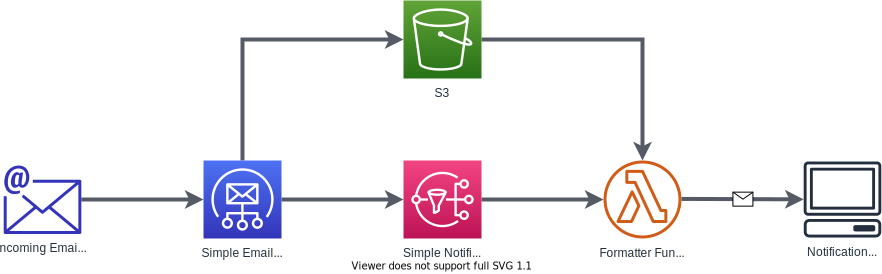

# SES Email Formatter

## About
Amazon Simple Email Service (SES) can be configured to send notifications when emails are sent to particular addresses. Unfortunately, these notifications are extremely difficult to read. Typically, the notification is a large blob of JSON. This project creates a lambda function that formats that JSON blob as a human-readable email. This formatted email summarizes all the important information, and provides a download link to the notification recipient. 

  

### Architecture

  

SES handles all incoming emails for a particular domain name. When SES recieves an email, it saves the email to an S3 bucket and publishes a message to an SNS topic. The email formatter lambda function is subscribed to this SNS topic. Once the lambda function is triggered, it downloads the email from S3 and uses it to generate a human readable email. The lambda function sends this email to the notification recipient.

**This repository only contains the infrastructure-as-code (IaC) for the formatter lambda function.**

## Useful commands

This application uses the AWS CDK to generate the lambda function. To build/deploy this project use the CDK CLI.

 * `npm run build`   compile typescript to js
 * `npm run watch`   watch for changes and compile
 * `npm run test`    perform the jest unit tests
 * `cdk deploy`      deploy this stack to your default AWS account/region
 * `cdk diff`        compare deployed stack with current state
 * `cdk synth`       emits the synthesized CloudFormation template
