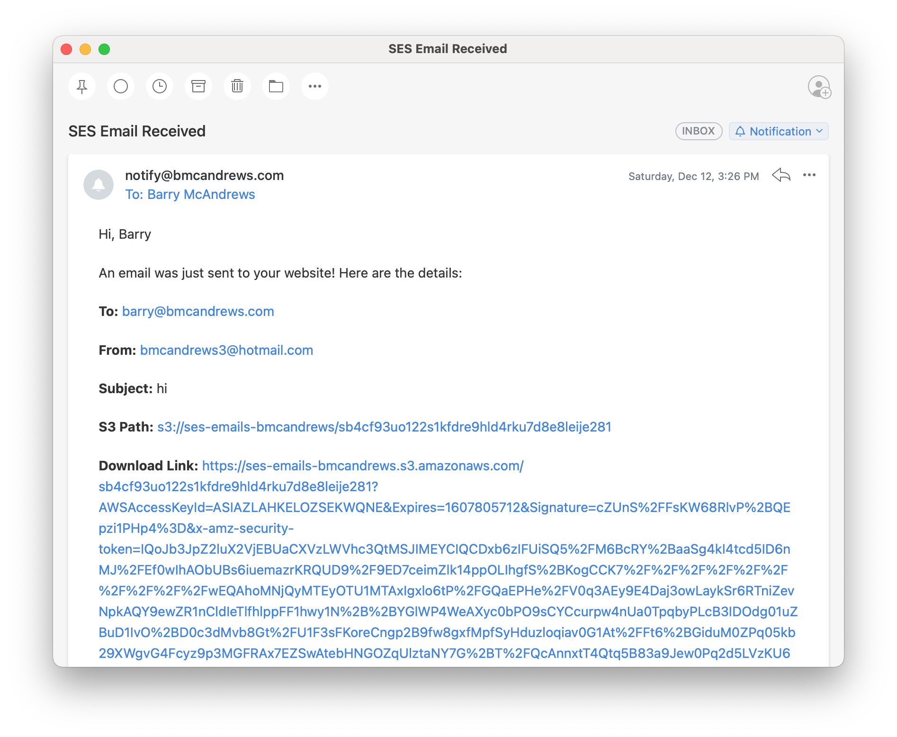

# SES Email Formatter

Amazon Simple Email Service (SES) can be configured to send notifications when emails are sent to particular addresses. Unfortunately, these notifications are extremely difficult to read. Typically, the notification is a large blob of JSON. This project creates a lambda function that formats that JSON blob as a human-readable email. This formatted email summarizes all the important information, and provides a download link to the notification recipient. 

  

This is an AWS CDK application. To build/deploy this project use the CDK CLI.

## Useful commands

 * `npm run build`   compile typescript to js
 * `npm run watch`   watch for changes and compile
 * `npm run test`    perform the jest unit tests
 * `cdk deploy`      deploy this stack to your default AWS account/region
 * `cdk diff`        compare deployed stack with current state
 * `cdk synth`       emits the synthesized CloudFormation template
